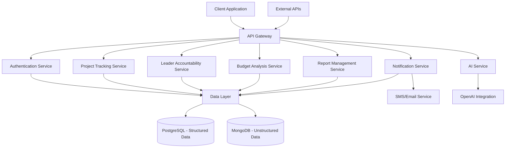
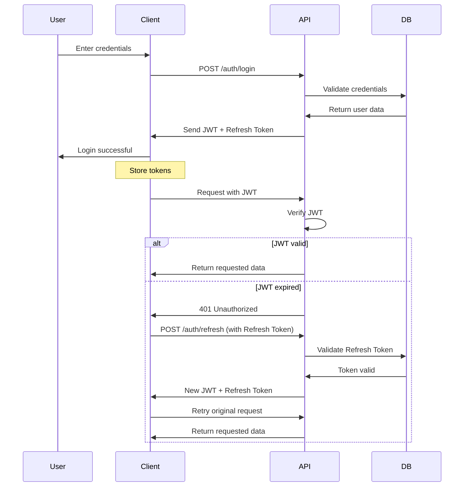
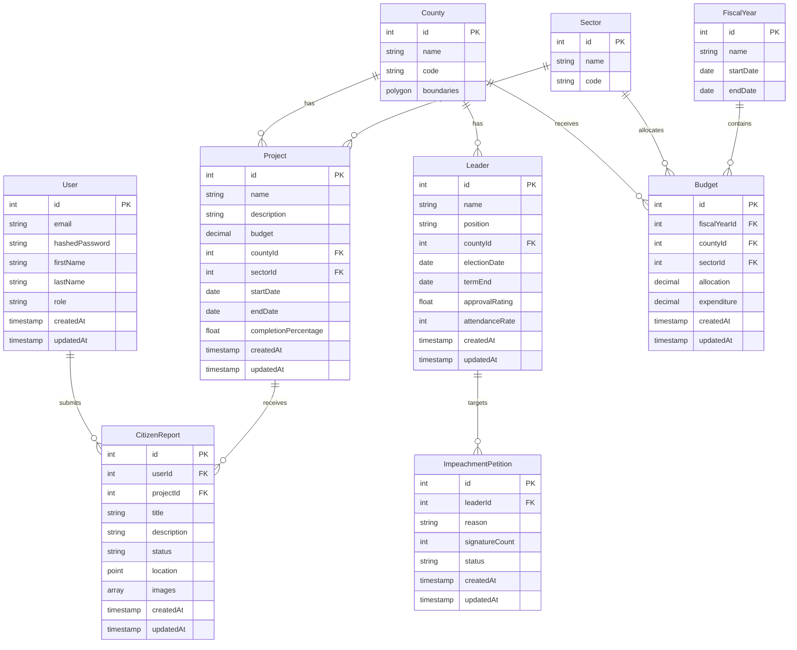

# 🔍 TruthKenya: Empowering Citizens Through Transparency 

[](https://opensource.org/licenses/MIT)
[](https://reactjs.org/)
[](https://nextjs.org/)
[](https://nodejs.org/)
[](https://www.postgresql.org/)


## 📋 Table of Contents

1. [Vision & Mission](#vision--mission)
2. [System Architecture](#system-architecture)
3. [Key Features](#key-features)
4. [Technology Stack](#technology-stack)
5. [Installation & Setup](#installation--setup)
6. [Implementation Details](#implementation-details)
7. [Database Schema](#database-schema)
8. [API Documentation](#api-documentation)
9. [Future Integrations](#future-integrations)
10. [Challenges & Solutions](#challenges--solutions)
11. [Contributing](#contributing)
12. [Team & Credits](#team--credits)
13. [License](#license)
14. [Contact](#contact)

---

## 🌟 Vision & Mission

"Politicians told us to follow the money. So we built a map." — Ian Kuria, Lead Developer

Billions vanish from Kenya's budget each year. We're the flashlight app for your tax shillings.

## Vision
A Kenya where government budgets are as closely watched as Premier League matches, and where accountability isn't just a campaign slogan.

## Mission
Turn boring government data into tools that bite. Make transparency irresistible, corruption expensive, and citizen engagement the national sport.

## 🏗️ System Architecture

TruthKenya employs a modern, scalable architecture to deliver real-time insights into government spending and actions.



Our microservices architecture ensures:
- 🔄 **Scalability**: Each service can scale independently based on demand
- 🔒 **Security**: Isolated services reduce vulnerability surface area
- 🚀 **Deployment**: Continuous deployment with minimal downtime
- 🔌 **Integration**: Seamless connection with external data sources

---

## 🎯 Key Features

### 1. 📊 Interactive Dashboard

The TruthKenya dashboard provides citizens with at-a-glance insights into Kenya's financial health and government performance.

```jsx
// Dashboard KPI Component
export const EconomicIndicators = () => {
  const { data, isLoading } = useDashboardStats();
  
  return (
    <div className="grid grid-cols-1 md:grid-cols-3 gap-6">
      <StatCard 
        title="Government Debt" 
        value={`KES ${data?.governmentDebt}T`}
        trend={+2.4}
        description="KES 295,432 per Citizen" 
        color="rose"
      />
      <StatCard 
        title="Annual Budget" 
        value={`KES ${data?.annualBudget}T`}
        trend={-0.8}
        description="FY 2024/2025" 
        color="blue"
      />
      <StatCard 
        title="Unemployment Rate" 
        value={`${data?.unemploymentRate}%`}
        trend={+1.2}
        description="7.7M people without jobs" 
        color="amber"
      />
    </div>
  );
};
```


### 2. 🕵️ Corruption Impact Calculator

Translating abstract corruption figures into tangible impacts helps citizens understand what's at stake.

```jsx
// Corruption Impact Component
export const ImpactCalculator = ({ amount }) => {
  const schools = Math.round(amount / 35000000); // Avg primary school cost
  const hospitals = Math.round(amount / 120000000); // Avg health center cost
  const roads = Math.round(amount / 80000000 * 1000); // Cost per km of road
  
  return (
    <div className="p-6 bg-red-50 border border-red-200 rounded-lg">
      <h3 className="text-xl font-bold mb-4">What KES {formatNumber(amount)} could have built:</h3>
      <div className="grid grid-cols-3 gap-4 text-center">
        <ImpactCard icon="🏥" value={hospitals} label="Hospitals" />
        <ImpactCard icon="🏫" value={schools} label="Schools" />
        <ImpactCard icon="🛣️" value={roads} label="KM of Roads" />
      </div>
    </div>
  );
};
```


### 3. 📑 Project Tracking System

Monitor government projects from initiation to completion with citizen reporting capabilities.

```jsx
// Project Card Component
export const ProjectCard = ({ project }) => {
  return (
    <div className="border rounded-lg overflow-hidden shadow-sm hover:shadow-md transition-shadow">
      
      
      <div className="p-4">
        <h3 className="font-bold text-lg">{project.name}</h3>
        <p className="text-gray-600 text-sm mb-3">{project.description}</p>
        
        <div className="flex items-center mb-2">
          <MapPinIcon className="h-4 w-4 text-gray-500 mr-1" />
          <span className="text-sm">{project.location}</span>
        </div>
        
        <div className="flex justify-between mb-4">
          <div>
            <p className="text-sm text-gray-500">Budget</p>
            <p className="font-medium">KES {formatNumber(project.budget)}</p>
          </div>
          <div>
            <p className="text-sm text-gray-500">Deadline</p>
            <p className="font-medium">{formatDate(project.deadline)}</p>
          </div>
        </div>
        
        <div className="mb-3">
          <div className="flex justify-between mb-1">
            <span className="text-sm">Completion</span>
            <span className="text-sm font-medium">{project.completionPercentage}%</span>
          </div>
          <div className="w-full bg-gray-200 rounded-full h-2">
            <div 
              className="bg-blue-600 h-2 rounded-full" 
              style={{ width: `${project.completionPercentage}%` }}
            ></div>
          </div>
        </div>
        
        <div className="flex justify-between items-center">
          <div className="flex">
            {[1, 2, 3, 4, 5].map((star) => (
              <StarIcon 
                key={star}
                className={`h-4 w-4 ${star <= project.rating ? 'text-yellow-400' : 'text-gray-300'}`}
              />
            ))}
            <span className="text-sm ml-1">{project.rating.toFixed(1)}</span>
          </div>
          <Button size="sm">View Details</Button>
        </div>
      </div>
    </div>
  );
};
```


### 4. 🗳️ Leader Accountability

Track elected officials' performance with data-driven metrics and citizen ratings.

```jsx
// Leader Profile Component
export const LeaderProfile = ({ leader }) => {
  const { 
    name, position, county, imageUrl, 
    projectsCompleted, projectsOngoing, 
    attendanceRate, fundsUtilized, fundsAllocated,
    approvalRating 
  } = leader;
  
  return (
    <div className="flex flex-col md:flex-row gap-6 p-6 bg-white rounded-lg shadow">
      <div className="md:w-1/4 flex flex-col items-center">
        
        <h3 className="font-bold text-xl text-center">{name}</h3>
        <p className="text-gray-600 text-center mb-1">{position}</p>
        <p className="text-gray-500 text-sm text-center">{county} County</p>
      </div>
      
      <div className="md:w-3/4">
        <div className="grid grid-cols-1 md:grid-cols-3 gap-4 mb-6">
          <StatCard label="Projects Completed" value={projectsCompleted} />
          <StatCard label="Projects Ongoing" value={projectsOngoing} />
          <StatCard label="Attendance Rate" value={`${attendanceRate}%`} />
        </div>
        
        <div className="mb-6">
          <h4 className="font-medium mb-2">Funds Utilization</h4>
          <div className="flex justify-between mb-1">
            <span className="text-sm">KES {formatNumber(fundsUtilized)}</span>
            <span className="text-sm">KES {formatNumber(fundsAllocated)}</span>
          </div>
          <div className="w-full bg-gray-200 rounded-full h-2">
            <div 
              className="bg-green-600 h-2 rounded-full" 
              style={{ width: `${(fundsUtilized/fundsAllocated) * 100}%` }}
            ></div>
          </div>
        </div>
        
        <div className="mb-6">
          <h4 className="font-medium mb-2">Public Approval Rating</h4>
          <div className="flex items-center gap-4">
            <div className="text-3xl font-bold">{approvalRating.toFixed(1)}</div>
            <div className="flex-1">
              <ApprovalRatingStars rating={approvalRating} />
            </div>
          </div>
        </div>
        
        <div className="flex gap-3">
          <Button>Vote Again</Button>
          <Button variant="outline" className="text-red-500 border-red-300">
            Impeach
          </Button>
        </div>
      </div>
    </div>
  );
};
```


### 5. 🤖 AI-Powered Civic Education

An intelligent chatbot helping citizens understand complex governance and economic topics.

```jsx
// AI Chatbot Component
export const CivicsBot = () => {
  const [query, setQuery] = useState('');
  const [messages, setMessages] = useState([
    { 
      role: 'assistant', 
      content: 'Hello! I'm TruthBot. Ask me anything about Kenya's government, budgets, or civic processes.' 
    }
  ]);
  const [isLoading, setIsLoading] = useState(false);
  
  const handleSubmit = async (e) => {
    e.preventDefault();
    if (!query.trim()) return;
    
    // Add user message
    setMessages(prev => [...prev, { role: 'user', content: query }]);
    setIsLoading(true);
    
    try {
      const response = await fetch('/api/chat', {
        method: 'POST',
        headers: { 'Content-Type': 'application/json' },
        body: JSON.stringify({ 
          messages: [...messages, { role: 'user', content: query }] 
        })
      });
      
      const data = await response.json();
      setMessages(prev => [...prev, { role: 'assistant', content: data.content }]);
    } catch (error) {
      console.error('Error fetching response:', error);
      setMessages(prev => [...prev, { 
        role: 'assistant', 
        content: 'Sorry, I encountered an error. Please try again.' 
      }]);
    } finally {
      setIsLoading(false);
      setQuery('');
    }
  };
  
  return (
    <div className="border rounded-lg overflow-hidden shadow-md h-[500px] flex flex-col">
      <div className="bg-blue-600 text-white p-3">
        <h3 className="font-bold">TruthBot - Civic Education Assistant</h3>
      </div>
      
      <div className="flex-1 p-4 overflow-y-auto bg-gray-50">
        {messages.map((msg, index) => (
          <div 
            key={index}
            className={`mb-3 ${msg.role === 'assistant' ? 'pl-2' : 'pl-10'}`}
          >
            <div 
              className={`p-3 rounded-lg ${
                msg.role === 'assistant' 
                  ? 'bg-white border' 
                  : 'bg-blue-500 text-white'
              }`}
            >
              {msg.content}
            </div>
          </div>
        ))}
        {isLoading && (
          <div className="pl-2 mb-3">
            <div className="p-3 rounded-lg bg-white border">
              <div className="flex gap-2">
                <div className="w-2 h-2 bg-gray-300 rounded-full animate-bounce" />
                <div className="w-2 h-2 bg-gray-300 rounded-full animate-bounce" style={{ animationDelay: '0.2s' }} />
                <div className="w-2 h-2 bg-gray-300 rounded-full animate-bounce" style={{ animationDelay: '0.4s' }} />
              </div>
            </div>
          </div>
        )}
      </div>
      
      <form onSubmit={handleSubmit} className="p-3 border-t bg-white">
        <div className="flex gap-2">
          <input
            type="text"
            value={query}
            onChange={e => setQuery(e.target.value)}
            placeholder="Ask about Kenya's governance..."
            className="flex-1 border rounded-md p-2"
          />
          <Button type="submit" disabled={isLoading}>
            {isLoading ? <Spinner size="sm" /> : <SendIcon className="h-4 w-4" />}
          </Button>
        </div>
      </form>
    </div>
  );
};
```


---

## 💻 Technology Stack

TruthKenya leverages cutting-edge technologies to deliver a robust, scalable platform:

### Frontend
- **React 18** with **Next.js 13**: For server-side rendering and optimal SEO
- **Tailwind CSS**: For responsive, utility-first styling
- **D3.js & Recharts**: For dynamic data visualizations
- **ShadcnUI**: For consistent, accessible UI components
- **React Query**: For efficient data fetching and caching

### Backend
- **Node.js**: Runtime environment
- **Express.js**: API framework
- **Prisma ORM**: Type-safe database queries
- **JWT**: For secure authentication
- **OpenAI API**: For AI-powered civic education
- **Twilio**: For SMS notifications

### Database
- **PostgreSQL**: Primary database for structured data
- **MongoDB**: For unstructured data (citizen reports, images)
- **Redis**: For caching and rate limiting

### DevOps
- **Docker & Kubernetes**: For containerization and orchestration
- **GitHub Actions**: For CI/CD pipelines
- **AWS**: For cloud infrastructure
- **Terraform**: For infrastructure as code

### Testing & Quality
- **Jest & React Testing Library**: For unit and integration tests
- **Cypress**: For end-to-end testing
- **ESLint & Prettier**: For code quality and consistency

---

## 🚀 Installation & Setup

Get TruthKenya up and running in your local environment:

### Prerequisites
- Node.js v16+
- PostgreSQL 14+
- MongoDB 5+
- Redis 6+

### Setup Steps

1. **Clone the repository**
```bash
git clone https://github.com/truthkenya/platform.git
cd platform
```

2. **Install dependencies**
```bash
# Install frontend dependencies
cd client
npm install

# Install backend dependencies
cd ../server
npm install
```

3. **Set up environment variables**
```bash
# In the server directory
cp .env.example .env
# Edit .env with your database credentials and API keys
```

4. **Set up the database**
```bash
# In the server directory
npx prisma migrate dev
npx prisma db seed
```

5. **Start the development servers**
```bash
# Start the backend server (from server directory)
npm run dev

# In a new terminal, start the frontend (from client directory)
npm run dev
```

6. **Access the application**
- Frontend: http://localhost:3000
- API: http://localhost:8000

---

## 🛠️ Implementation Details

### Authentication Flow

TruthKenya implements a secure authentication system using JWT with refresh tokens:



### Real-time Updates

We use WebSockets for real-time updates on project status changes and citizen reports:

```javascript
// server/services/websocket.js
const { Server } = require('socket.io');

module.exports = (httpServer) => {
  const io = new Server(httpServer, {
    cors: {
      origin: process.env.CLIENT_URL,
      methods: ["GET", "POST"]
    }
  });
  
  io.on('connection', (socket) => {
    console.log('New client connected');
    
    // Join room for specific county updates
    socket.on('joinCounty', (countyId) => {
      socket.join(`county-${countyId}`);
    });
    
    // Join room for specific project updates
    socket.on('joinProject', (projectId) => {
      socket.join(`project-${projectId}`);
    });
    
    // Listen for new reports
    socket.on('submitReport', async (report) => {
      try {
        // Save report to database
        const savedReport = await reportService.create(report);
        
        // Notify admins
        io.to('admins').emit('newReport', savedReport);
        
        // Notify users following this project
        io.to(`project-${report.projectId}`).emit('projectUpdate', {
          type: 'newReport',
          data: savedReport
        });
        
        // Notify users in this county
        io.to(`county-${report.countyId}`).emit('countyUpdate', {
          type: 'newReport',
          data: savedReport
        });
      } catch (error) {
        socket.emit('error', { message: 'Failed to submit report' });
      }
    });
    
    socket.on('disconnect', () => {
      console.log('Client disconnected');
    });
  });
  
  return io;
};
```

### Data Visualization Strategy

TruthKenya implements a hybrid approach to data visualization:

1. **Server-side data preparation**: Complex aggregations are performed on the server
2. **Client-side rendering**: D3.js and Recharts render visualizations client-side
3. **Progressive enhancement**: Basic charts work without JavaScript, enhanced with interactivity when available

```jsx
// client/components/charts/BudgetBreakdown.jsx
import { ResponsiveContainer, PieChart, Pie, Cell, Tooltip, Legend } from 'recharts';

export const BudgetBreakdown = ({ data }) => {
  const COLORS = ['#FF8042', '#0088FE', '#00C49F', '#FFBB28', '#FF00FF', '#808080'];
  
  return (
    <div className="h-72">
      <h3 className="text-lg font-medium mb-3">Budget Allocation</h3>
      <ResponsiveContainer width="100%" height="100%">
        <PieChart>
          <Pie
            data={data}
            cx="50%"
            cy="50%"
            labelLine={false}
            outerRadius={80}
            fill="#8884d8"
            dataKey="value"
            label={({ name, percent }) => `${name} ${(percent * 100).toFixed(0)}%`}
          >
            {data.map((entry, index) => (
              <Cell key={`cell-${index}`} fill={COLORS[index % COLORS.length]} />
            ))}
          </Pie>
          <Tooltip formatter={(value) => `KES ${value.toLocaleString()}`} />
          <Legend />
        </PieChart>
      </ResponsiveContainer>
    </div>
  );
};
```

---

## 📊 Database Schema

TruthKenya uses a normalized database design to efficiently store and retrieve data:



Our database design principles include:

- **Normalization**: Reduces data redundancy
- **Indexing**: Optimizes query performance
- **Temporal tracking**: Historical data preservation
- **Spatial support**: Geolocation for projects and reports

---

## 📡 API Documentation

TruthKenya exposes a RESTful API with the following key endpoints:

### Authentication
- `POST /api/auth/register` - Register a new user
- `POST /api/auth/login` - Login and receive tokens
- `POST /api/auth/refresh` - Refresh access token
- `POST /api/auth/logout` - Invalidate tokens

### Projects
- `GET /api/projects` - List all projects (with filtering)
- `GET /api/projects/:id` - Get project details
- `POST /api/projects/:id/reports` - Submit a citizen report
- `GET /api/projects/:id/reports` - Get reports for a project

### Leaders
- `GET /api/leaders` - List all leaders (with filtering)
- `GET /api/leaders/:id` - Get leader profile
- `POST /api/leaders/:id/ratings` - Submit leader rating
- `POST /api/leaders/:id/impeachment` - Submit impeachment signature

### Budgets
- `GET /api/budgets` - Get budget allocations (with filtering)
- `GET /api/budgets/fiscal-years` - List fiscal years
- `GET /api/budgets/sectors` - List budget sectors

### Counties
- `GET /api/counties` - List all counties
- `GET /api/counties/:id` - Get county details
- `GET /api/counties/:id/projects` - Get county projects
- `GET /api/counties/:id/leaders` - Get county leaders

### Reports
- `GET /api/reports` - List citizen reports (with filtering)
- `POST /api/reports` - Create a new report
- `GET /api/reports/:id` - Get report details

### Analytics
- `GET /api/analytics/dashboard` - Get dashboard statistics
- `GET /api/analytics/corruption` - Get corruption statistics
- `GET /api/analytics/performance` - Get performance rankings

All API endpoints include:
- Pagination support
- Filtering capabilities
- Sorting options
- Proper error handling
- Rate limiting

---

## 🔮 Future Integrations

TruthKenya has an ambitious roadmap for expanding functionality:

### 1. 📱 Mobile App
A dedicated mobile application to enable offline data collection and wider reach, especially in rural areas with limited connectivity.

### 2. 🗣️ Multi-language Support
Adding support for Swahili and other local languages to increase accessibility across Kenya.

### 3. 🛰️ Satellite Imagery Integration
Partnership with satellite imagery providers to monitor infrastructure projects and verify completion claims.

### 4. 🔍 Procurement Monitoring System
Integration with e-procurement systems to track government contracts and flag potential irregularities.

### 5. 📊 Advanced Economic Impact Models
Sophisticated economic models to predict the impact of government policies on different demographic groups.

### 6. 🔄 Blockchain Verification
Implementation of blockchain technology for immutable record-keeping of government spending.

### 7. 📰 Media Monitoring API
Automated tracking of news mentions related to corruption cases and government projects.

### 8. 🔔 Personalized Alerts System
Allow users to subscribe to alerts for specific projects, leaders, or geographic areas.

---

## 🧩 Challenges & Solutions

Building TruthKenya has presented unique challenges:

### 1. 📊 Data Availability
**Challenge**: Government data is often inconsistent, outdated, or unavailable.  
**Solution**: We've implemented a multi-source data collection approach combining official records, media reports, and verified citizen submissions.

### 2. 🔒 Security Concerns
**Challenge**: Protecting whistleblowers and preventing system abuse.  
**Solution**: End-to-end encryption, anonymous reporting options, and robust verification processes.

### 3. 🌐 Connectivity Issues
**Challenge**: Many Kenyans have limited internet access.  
**Solution**: Low-bandwidth mode, SMS integration, and offline capability for the future mobile app.

### 4. 🛡️ Political Resistance
**Challenge**: Potential pushback from political entities.  
**Solution**: Strict factual accuracy, non-partisan approach, and transparent methodology.

### 5. 📱 Digital Literacy
**Challenge**: Varying levels of digital literacy among citizens.  
**Solution**: Intuitive UI, educational resources, and community training initiatives.

### 6. 🔄 Real-time Data Updates
**Challenge**: Keeping information current across multiple data sources.  
**Solution**: Automated data ingestion pipelines, scheduled updates, and crowdsourced verification.

---

## 👥 Contributing

We welcome contributions to TruthKenya! Here's how you can help:

### Getting Started
1. Fork the repository
2. Create a feature branch: `git checkout -b feature/my-feature`
3. Commit changes: `git commit -am 'Add my feature'`
4. Push to branch: `git push origin feature/my-feature`
5. Submit a pull request

### Contribution Guidelines
- Follow the code style and conventions
- Write tests for new features
- Update documentation as needed
- Respect the code of conduct

### Areas We Need Help With
- 🖥️ Frontend Development
- 🔄 API Integrations
- 📊 Data Visualization
- 📱 Mobile Development
- 🌐 Localization
- 📝 Documentation

---

## 🌟 Team & Credits

TruthKenya is led by:

### Ian Kuria
- **Lead Developer & Architect**
- **Website**: [kuria.pro](https://kuria.pro)
- **GitHub**: [@kuriabyte](https://github.com/kuriabyte)
- **Email**: ian@truthkenya.com

### Contributors
Ian Kuria 
- Data Visualization
-  Backend Development
-  UI/UX Design
-  Content & Research

### Special Thanks
- Kenya National Bureau of Statistics
- Transparency International Kenya
- Open Institute

---

## 📜 License

TruthKenya is released under the [MIT License](https://opensource.org/licenses/MIT).

---

## 📞 Contact

- **Website**: [truthkenya.com](https://truthkenya.com)
- **Email**: info@truthkenya.com
- **Twitter**: [@TruthKenya](https://twitter.com/truthkenya)
- **GitHub**: [github.com/truthkenya](https://github.com/truthkenya)
- 

---


<p align="center">
  <em>Building a more transparent Kenya, one data point at a time.</em><br>
  <em>#TruthMatters #OpenKenya #CitizenEmpowerment</em>
</p>
